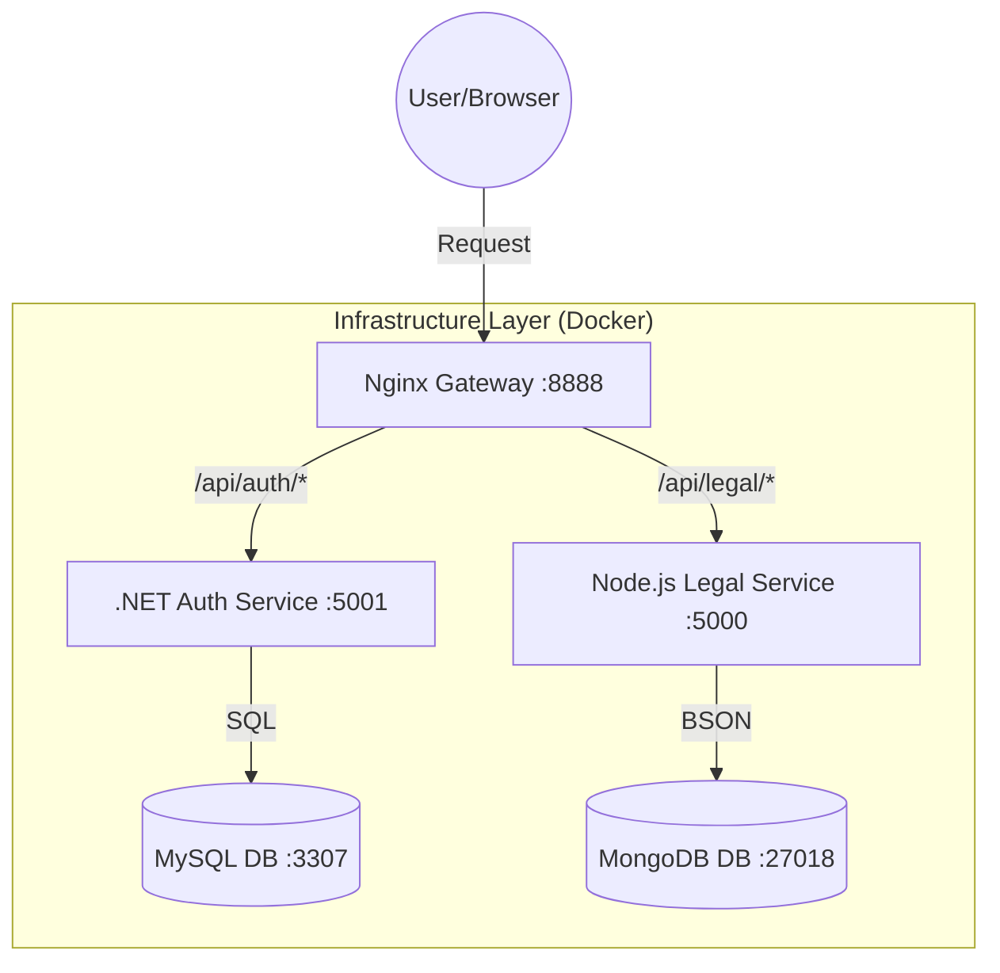

# LegalConnect Project Documentation

## 1. Project Overview
LegalConnect is a sophisticated legal information platform designed to provide hierarchical access to legal acts, statutes, and user management. The project uses a modern **Microservices Architecture** to ensure scalability, maintainability, and technological flexibility. This architectural choice allows us to use the best tool for each specific job, resulting in a robust and future-proof ecosystem.

---

## 2. Technology Stack & Rationale

### ⚛️ Angular (Frontend)
*   **What it is**: A platform and framework for building single-page client applications using HTML and TypeScript.
*   **Why we used it**: Angular provides a robust, enterprise-grade framework with a strict component-based architecture. It ensures consistency across large development teams and provides powerful tools like **RxJS** for reactive programming and **Dependency Injection** for better modularity.
*   **How it's used**: It serves as the "brain" of the user interface, managing state, routing between different legal modules, and communicating with the backend services through a unified API Gateway.

### 🟢 Node.js with TypeScript (Legal Service)
*   **What it is**: A JavaScript runtime built on Chrome's V8 engine, enhanced with TypeScript for static type checking.
*   **Why we used it**: Node.js is exceptionally fast for I/O-bound tasks. Since legal data is essentially a collection of JSON-like documents, Node's native handling of JSON and its non-blocking event loop make it ideal for serving large hierarchical datasets without performance bottlenecks.
*   **How it's used**: It handles the logic for retrieving, searching, and structuring legal acts. It interfaces directly with MongoDB to serve complex data structures to the frontend.

### 🔷 .NET Core (Auth & Core Service)
*   **What it is**: A high-performance, open-source, cross-platform framework for building modern cloud-based apps.
*   **Why we used it**: For critical systems like Authentication and Identity Management, security and performance are paramount. .NET Core offers built-in security features, high-speed execution, and a mature ecosystem for relational database management (Entity Framework).
*   **How it's used**: It manages User accounts, Roles, Permissions, and JWT (JSON Web Token) generation. It ensures that only authorized users can access specific legal tiers.

### 🐬 MySQL (Relational Database)
*   **What it is**: The world's most popular open-source relational database management system (RDBMS).
*   **Why we used it**: User profiles, subscription plans, and audit logs are inherently relational. MySQL provides **ACID compliance** (Atomicity, Consistency, Isolation, Durability), ensuring that financial or account-related transactions are never lost or corrupted.
*   **How it's used**: It serves as the primary storage for the .NET Auth service, keeping track of who is who and what they are allowed to do.

### 🍃 MongoDB (NoSQL Database)
*   **What it is**: A document-oriented NoSQL database that stores data in flexible, JSON-like documents.
*   **Why we used it**: Legal acts (Chapters -> Sections -> Sub-sections -> Clauses) are deeply nested and hierarchical. Representing this in a relational table would require complex joins and rigid schemas. MongoDB's **schema flexibility** allows us to store an entire law as a single, searchable document, drastically improving read speeds.
*   **How it's used**: It stores the "Knowledge Base" of the application—thousands of legal statutes and their historical versions.

### 🛡️ Nginx (API Gateway)
*   **What it is**: A high-performance web server, reverse proxy, and load balancer.
*   **Why we used it**: In a microservice world, the frontend shouldn't need to know the IP addresses of every service. Nginx acts as a **Single Entry Point** (Gateway), simplifying the frontend logic, providing a unified security layer, and handling Cross-Origin Resource Sharing (CORS) centrally.
*   **How it's used**: It listens on port 8888 and intelligently routes incoming traffic to either the Node.js service or the .NET service based on the URL path.

### 🐳 Docker & Docker Compose (Infrastructure)
*   **What it is**: A platform for developing, shipping, and running applications inside isolated containers.
*   **Why we used it**: "It works on my machine" is a thing of the past. Docker ensures that every developer (and the production server) runs exactly the same version of MySQL, MongoDB, and Nginx. It isolates the databases from the host system, making the setup clean and reproducible.
*   **How it's used**: We use `docker-compose.yml` to spin up the entire data and routing layer with a single command, orchestrating the connection between services and their persistent volumes.

---

## 3. Microservices Architecture: Deep Dive

We have moved away from "Monolithic" design (one giant app) to "Microservices" (many small apps).

### Separation of Concerns
By splitting **Authentication** (.NET) and **Legal Logic** (Node.js), we ensure that if the Legal service crashes under high search load, users can still log in and access other parts of the system. Each service can be updated, debugged, and deployed independently.

### Independent Scaling
During peak hours when many users are searching for laws, we can scale the **Legal Service** horizontally (run multiple instances) without wasting resources on the **Auth Service**, which might be idle.

---

## 4. Polyglot Persistence (The Best of Both Worlds)

The term "Polyglot Persistence" means using different database technologies for different data storage needs.

*   **Structured Data (MySQL)**: Best for data that doesn't change its shape often and requires strict relationships (e.g., a User *must* have a Role).
*   **Unstructured Data (MongoDB)**: Best for data that varies in complexity (e.g., one law might have 10 sections, another might have 100 with sub-clauses).

This hybrid approach gives LegalConnect the reliability of a traditional system and the speed of a modern document-based platform.

---

## 5. API Gateway & Routing Logic

The Nginx Gateway is the "Receptionist" of our application.

1.  **Unified Entry**: The frontend only ever talks to `http://localhost:8888`.
2.  **Path-Based Routing**:
    *   `GET /api/auth/profile` -> Nginx says "This is for the Auth Service" -> Routes to .NET.
    *   `POST /api/legal/search` -> Nginx says "This is for the Legal Service" -> Routes to Node.js.
3.  **Security Layer**: The gateway can be configured to block suspicious traffic or limit the number of requests (Rate Limiting) before they even reach our services.

---

## 6. Communication Flow (How it all connects)

1.  **Request Phase**: The user interacts with the Angular app. The app sends a request to the Nginx Gateway.
2.  **Routing Phase**: Nginx checks the path and proxies the request to the correct microservice.
3.  **Processing Phase**: The microservice (Node or .NET) performs business logic and interacts with its specific database.
4.  **Response Phase**: Data flows back through the gateway to the frontend, which renders the results beautifully using Tailwind CSS.
